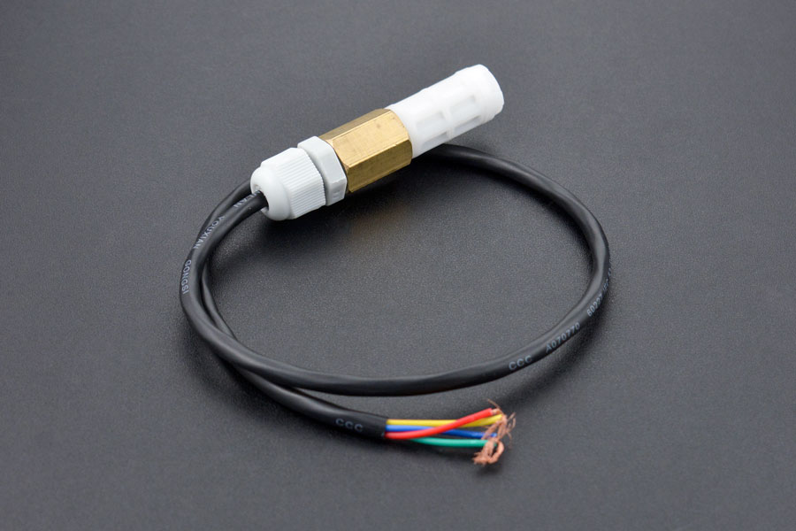
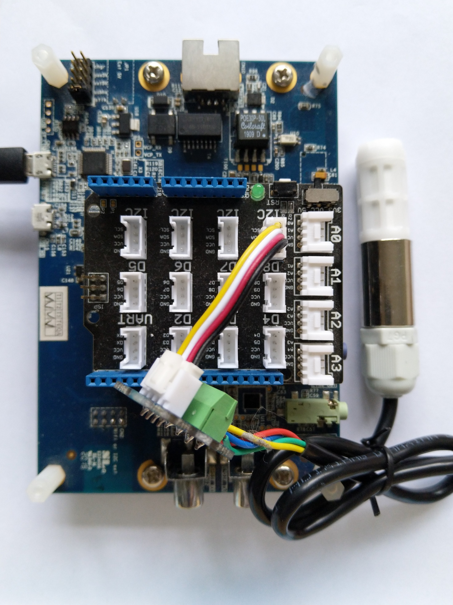

# SensirionSHT20.NetNF

A C# library for connecting an [SHT20 Temperature and Humidity Sensor](https://www.dfrobot.com/product-1636.html) to a [.NET nanoFramework](https://www.nanoframework.net/) powered device.

This repository has the source code for the series of blog posts written as I worked on the library

01. [SHT20 Basic connectivity](https://blog.devmobile.co.nz/2023/03/20/net-nanoframework-sht20-basic-connectivity/)
02. [SHT20 library on Github](https://blog.devmobile.co.nz/2023/03/30/net-nanoframework-sht20-library-on-github/)

<b>NB This library is a work in progress and should be considered late beta</b>

After soak testing I will "refactor" the library so it can be included in the [.NET nanoFramework IoT.Device](https://github.com/nanoframework/nanoFramework.IoT.Device) repository.
